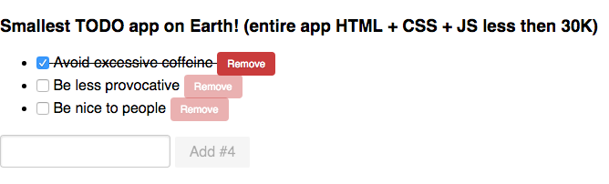

# riotjs-boilerplate



Tiny to do app built with [Riotjs](https://muut.com/riotjs/) and [Pure.css](http://purecss.io/) in less the 30K (in all)!

## Getting started

Prerequisite: *You need to have [nodejs npm](https://nodejs.org/) and [git](https://git-scm.com/) installed*

- Clone or download the repo
- Run ```sudo npm install -g gulp``` ( *install global tools* )
- ```cd``` into the project folder
- Run ```npm install``` ( *install project specific tools* and *install frontend dependency*)
- Run ```gulp watch``` (if you want build and serve the frontend and automatic reload the browser in case of changes, **good for development**)
- Or run ```gulp``` ( *build frontend* ) and ```gulp serve``` ( *serve the ```dist``` folder* ).

Note: *if you want to change port of the static server go to ```gulp/gulp.serve.js``` file*
